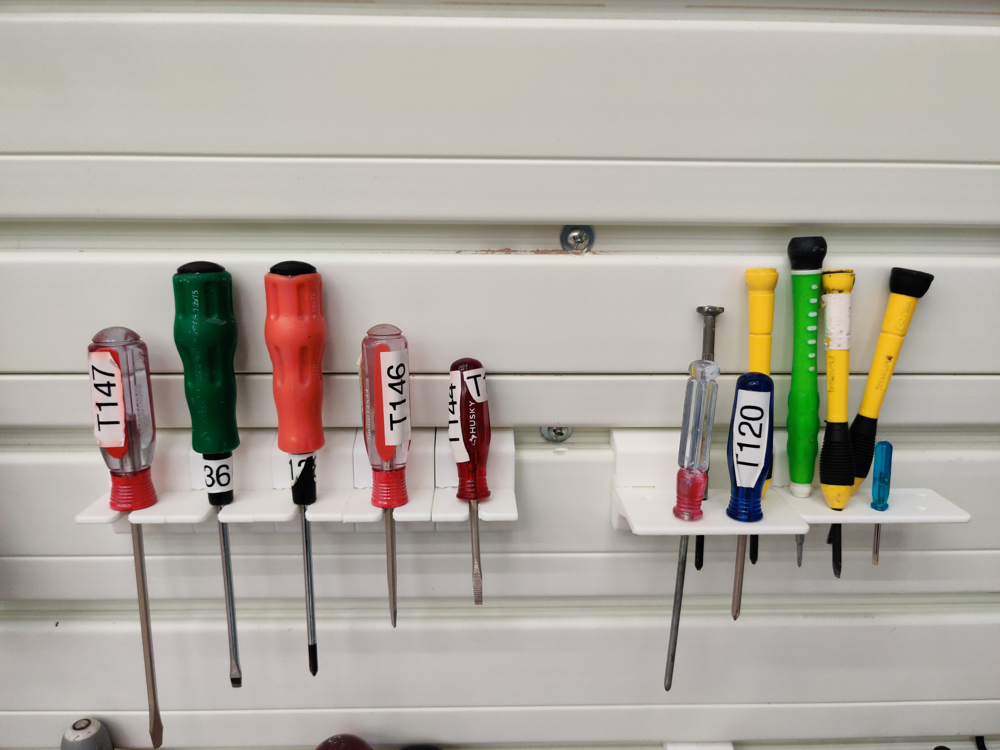

# FlowWall-Hangars
This repository contains custom 3D-printable hangars for the [FlowWall organization system](https://www.flowwall.com/). See [this post](https://uflbsail.net/?p=3584) for more information.

The STL files in this repository can be 3D-printed in PLA. I have not verified that they work with other materials, although I don't see any reason why not. Just be aware that the snaps might behave differently with different material stiffnesses.

Both the basic hangar and small tool holder parts can be printed without support as long as they are oriented correctly. The screwdriver holders require support for the slot that holds the screwdriver.
